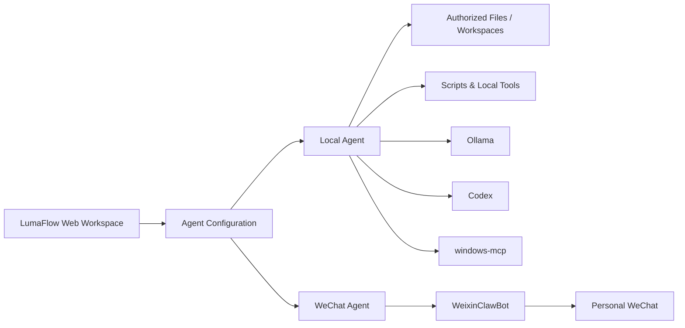

# LumaFlow

**LumaFlow** is an AI-agent workspace concept designed to connect local productivity agents with messaging-based agents while keeping their tools, workspaces and configuration organized.

## Overview

The project separates agents into two practical modes:

- **Local Agents** - agents that can work with authorized local files, folders, tools and workspaces.
- **WeChat Agents** - messaging-facing agents designed to map 1:1 to a WeixinClawBot connection for use through personal WeChat.

The goal is to make AI agents useful in real workflows rather than limiting them to a chat window.

## Core capabilities

- Agent-specific workspaces and configuration
- Authorized local file operations
- Local tools and script execution workflows
- Knowledge-base integration
- Local-model support through Ollama
- Coding / task execution workflows with Codex
- Desktop automation integration through windows-mcp
- WeixinClawBot integration for WeChat-facing agents
- Shared agent identity / configuration concepts between web and messaging experiences

## Example use cases

- Personal productivity assistant
- Research and document organization
- Local file and knowledge-base workflows
- Repetitive administrative task automation
- Messaging-based AI assistant through WeChat
- Tool-using agents that can move from conversation to action

## Architecture concept

## Portfolio note

LumaFlow is an independent AI-agent project / prototype. This page documents its product concept, architecture and intended workflows for portfolio presentation.
